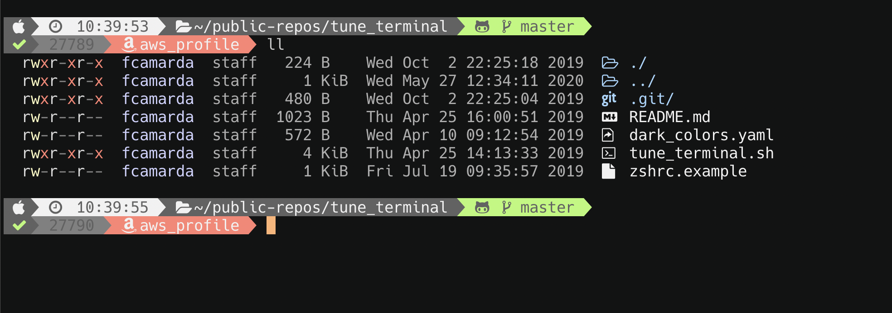

# Tune Terminal
Mac Terminal Customization.



# What this script does
- Update Homebrew package list.
- Installs Oh my Zsh and a few Zsh plugins including powerlevel10k.
- Configures Zsh as the default shell.
- Installs the Hack Nerd and Meslo LG fonts in the system.
- Installs `colorls`.
- (Optional - requests permission) Installs a `.zshrc` and `.p10k.sh` files in the `$HOME` dir, preserving the previous one with `.bak` extension. __NOTE:__ If you run the script twice or more, the `.bak` will be overwritten with the repo template.
- The .zshrc file has an alias for the `ls` and `ll` commands to call `colorls` instead of the default `ls` command.

# Installation
- Clone the repository.
```
git clone https://github.com/fededamian/tune_terminal
```

- Change into the directory.
```
cd tune_terminal
```

- Run the installer.
```
./tune_terminal.sh
```

- Manual requirement:
Configure the font of your Terminal or iTerm app to use the Hack Nerd font.
